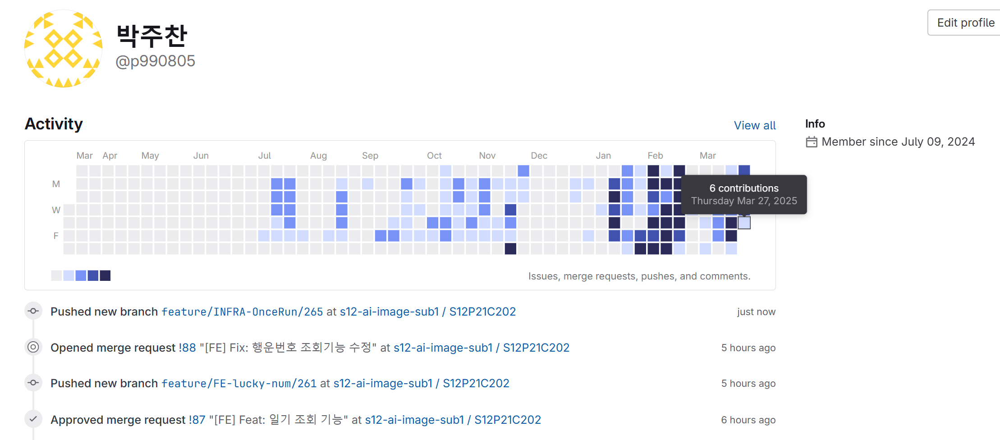
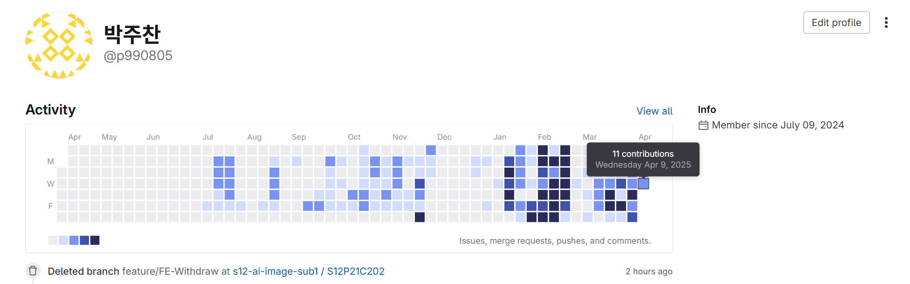

# 파일 존재 이유

- 현재 ssafy 12기로 프로젝트 기간에 gitlab을 사용하고 있어 git hub 대신 git lab을 사용하고 있음을 알릴려고 쓰겠습니다.

    
2025-03-20

    
2025-03-21

    
2025-03-22

    
2025-03-23

    
2025-03-24

    
2025-03-25

    
2025-03-26

    
2025-03-27

    
2025-03-28

    
2025-03-29

### 오늘은 주말사이 팀원간에 깃 충돌을 막기위해 로컬에서만 작업해서 기여도가 작습니다. !

    
2025-04-01

    
2025-04-02

    
2025-04-03

    
2025-04-04

    
2025-04-05

    
2025-04-06

    
2025-04-07

    
2025-04-08

    
2025-04-09

    
2025-04-10

